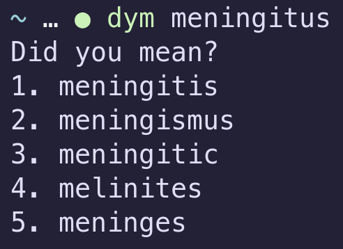
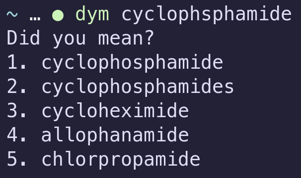

<h1 align="center">DidYouMean</h1>

<p align="center">
    <a href="LICENSE"></a>
    <a href="https://aur.archlinux.org/packages/didyoumean-git/"> </a>
    <a href="https://github.com/NixOS/nixpkgs/tree/master/pkgs/tools/misc/didyoumean"></a>
    <a href="https://github.com/hisbaan/homebrew-tap"></a>
    <a href="https://lib.rs/crates/didyoumean"> </a>
</p>

DidYouMean (or `dym`) is a command-line spelling corrector written in rust utilizing [Levenshtein distance](https://en.wikipedia.org/wiki/Levenshtein_distance). DidYouMean is for those moments when you know what a word sounds like, but you're not quite sure how it's spelled.

<p align="center">
    <!--  -->
    
</p>

## Installation

### Arch Linux (and derivatives)

DidYouMean is available on the AUR as three different packages:

- [didyoumean](https://aur.archlinux.org/packages/didyoumean): Last stable release, built from source (Thank you [orhun](https://github.com/orhun)!).
- [didyoumean-git](https://aur.archlinux.org/packages/didyoumean-git): Last git commit, built from source. This is the most up to date, but the least stable.
- [didyoumean-bin](https://aur.archlinux.org/packages/didyoumean-bin): Last stable release, distributed as a binary. This is only available for `x86_64` at the moment.

You can install it using any AUR helper. Using `paru`, the command would be as follows:

```sh
paru -S <package choice from above>
```

### NixOS

[evanjs](https://github.com/evanjs) very kindly packaged `didyoumean` for NixOS. The command to install is as follows:

```sh
nix-env install -iA nixpkgs.didyoumean
```

### Homebrew (macOS)

Homebrew is a package manager for macOS. Currently, I have only packaged an x86\_64 binary. The command to install it is as follows:

```sh
brew tap hisbaan/tap
brew install didyoumean
```

### Cargo

Run the following command to build `dym` from source and install it in your home directory. Ensure that you have `$CARGO_HOME/bin/` in your path.

```sh
cargo install didyoumean
```

## Developer Installation

The build dependencies for this project are `git`, `rust`, `rustc`, and `cargo`. First, clone this repository, then run

```sh
cargo run -- <args>
```

where `<args>` are the command-line arguments you would pass the DidYouMean binary. Note that this is an unoptimized build contianing debug information so it runs much, much slower.
